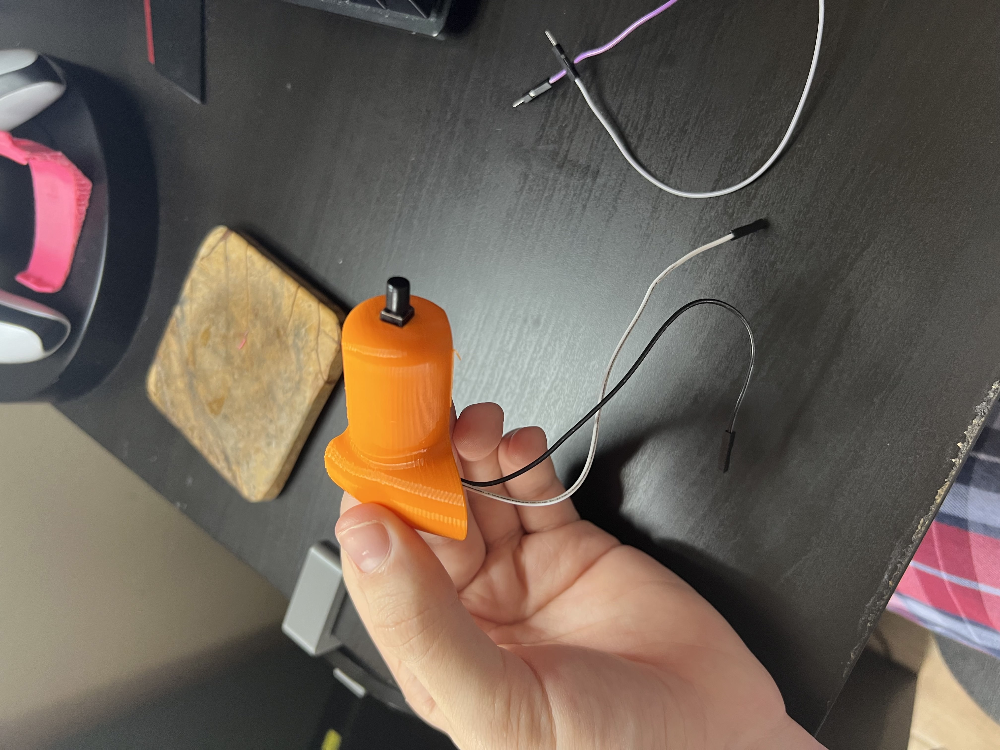

# Prototype Testing

## Prototype Design Plan

To minimize risk and cost, I decided to 3D print only the left thumbpad as a test component. This allowed me to validate the internal design without printing the entire yoke assembly. By testing a single component first, I could verify that all internal dimensions and component spaces were correct before full production.

- 3D print just the left thumbpad as the initial prototype
- Test if the modeled shafts are sized appropriately for internal routing
- Verify that wiring and button components fit within the modeled cutouts
- Confirm that cables, switches, and electronics fit in their designated spaces
- Validate component spacing and layout before committing to a full-scale print

## First Electrical Test

The first electrical test verified that all wiring and button connections functioned properly. I connected the components to a microcontroller and tested their integration with MobiFlight Connector software. This confirmed that the electrical design was sound and ready for integration into the full prototype. I repeated this testing step throughout the project at major milestones to ensure 100% functionality and catch any issues early. These ongoing electrical tests provided confidence that the system remained reliable as new components and features were added.

- Wire up button switches and encoder to the microcontroller
- Connect the system to MobiFlight Connector software
- Verify that the software recognizes all button inputs
- Confirm that electrical connections are stable and reliable
- Ensure buttons register accurately and will work when integrated into the yoke

